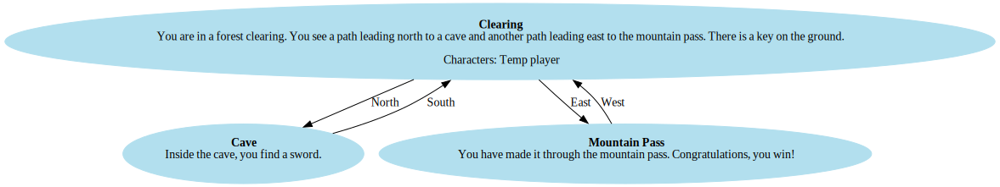

# Leave the forest

You are in a forest clearing. The exit beyond the mountain pass is blocked by a menacing ogre. A key lies on the ground, which may unlock the door to an old warrior's cave. Inside, a legendary sword rests on a stone pedestal, said to possess the power to defeat even the strongest foes. To claim it, you must unlock the cave and prove your worth to survive.

This game is inspired by the example given in the homework description.

